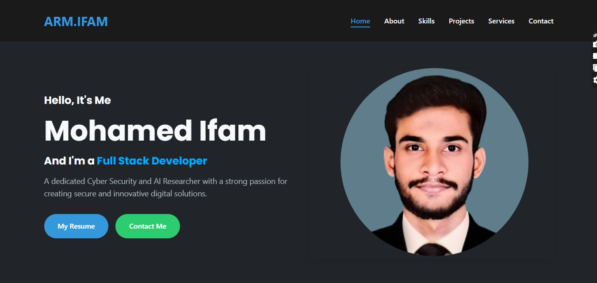

# My Portfolio

Welcome to my personal portfolio repository!  
This project showcases my skills, projects, and experiences in web development and software engineering.

## 🌐 Live Demo
[Visit My Portfolio](https://my-portfolio-ifam05.netlify.app/)  

## 🚀 Features
- Responsive personal portfolio website  
- Sections for **About Me, Skills, Projects, Services, Testimonials and Contact**  
- Clean and modern design  
- Easy to customize  

## 🛠️ Tech Stack
- **Frontend:** HTML, CSS, JavaScript 
- **Styling:** TailwindCSS / Bootstrap / Custom CSS 
- **Deployment:** Netlify 

## 📂 Repository
You can find this repository here:  
👉 [My-Portfolio](https://github.com/Ifam0605/My-Portfolio.git)

## 📬 Contact
Feel free to reach out to me:  
* GitHub: [Ifam0605](https://github.com/Ifam0605)
* LinkedIn: [Ifam-rahman](https://www.linkedin.com/in/ifam-rahman/)
* Email: [rahmanifam2005@gmail.com](mailto:rahmanifam2005@gmail.com) 

---

⭐ If you like this project, consider giving it a **star** on GitHub!
